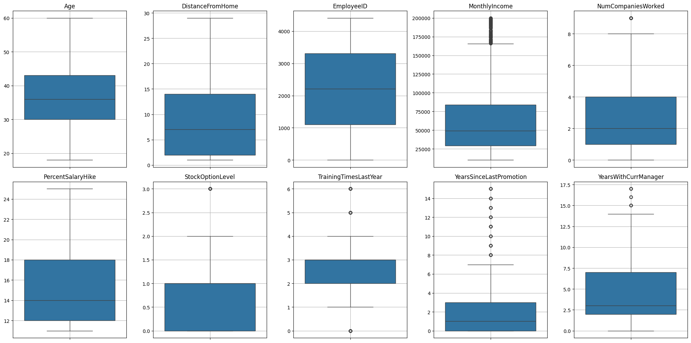

# Identificar y manejar datos discrepantes en variables númericas

### OPRIME ESTE LINK <mark style="color:red;">Google Colaboratory</mark> Proyecto Profundización\_ML.



### Conclusiones

* Se realiza el calculo para identificación de outliers en las siguientes variables 'Age', 'DistanceFromHome', 'EmployeeID', 'MonthlyIncome', 'StockOptionLevel' NumCompaniesWorked', 'PercentSalaryHike', 'TrainingTimesLastYear', 'YearsSinceLastPromotion', 'YearsWithCurrManager'.
* Se realiza gráfico de caja para visualizar los outliers.

<figure><figcaption></figcaption></figure>

* Se realiza histograma para visualizacón de las variables en estudio.

<figure><figcaption></figcaption></figure>

